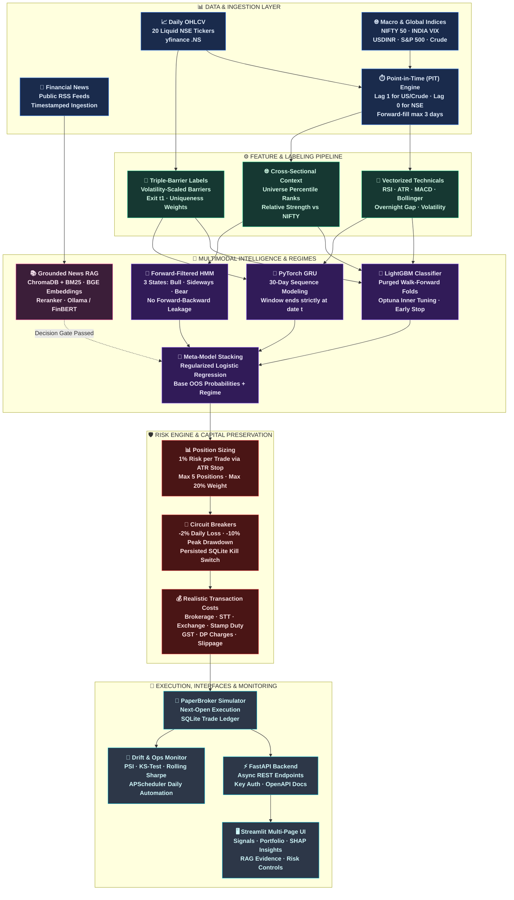
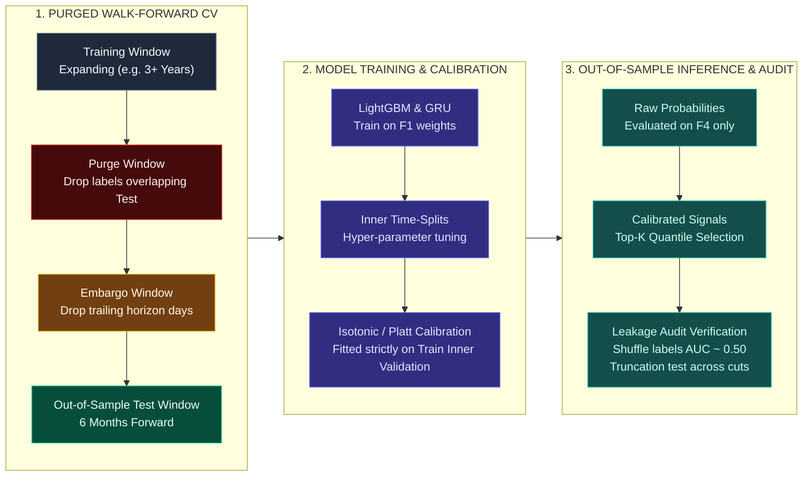
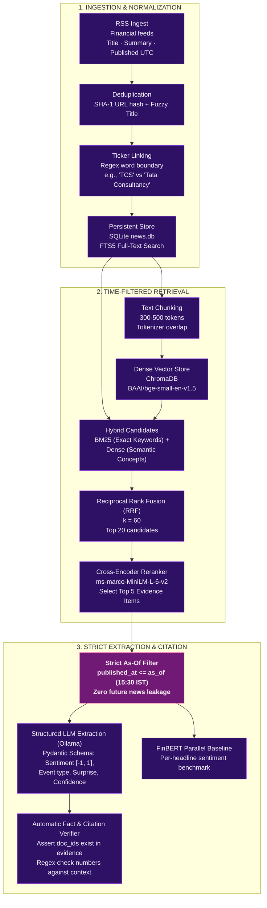
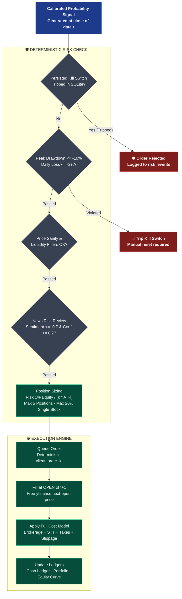

# Niveshak (निवेशक)

-orange)


**Niveshak (निवेशक) — Multimodal Stock Intelligence Engine for Indian Equities**  
*An educational, research-grade automated trading system combining leakage-free machine learning, regime detection, grounded financial news RAG, and institutional risk management.*

> [!NOTE]  
> **Reality Check on '100% Accuracy'**  
> No authentic ML system predicts stock prices with 100% certainty. Daily directional hit rates for rigorous, leakage-free models on liquid equities typically hover around **50%–56%**. If a daily financial model demonstrates 65%+ out-of-sample accuracy, it is a data leakage bug, not an alpha breakthrough. Niveshak is built from the ground up to eliminate look-ahead bias and measure genuine out-of-sample edge net of all statutory Indian equity transaction costs.

> [!IMPORTANT]  
> **Zero-Lookahead Guarantee**  
> Information at trading date $t$ only incorporates data available up to market close on $t$. All order executions take place strictly at the **OPEN of $t+1$**. Every feature transformation, market-wide rank, PIT alignment step, and model inference is subjected to automated truncation tests before deployment.

> [!WARNING]  
> **LLM Decision Boundary: Facts & Citations Only**  
> The Large Language Model (LLM) **never** issues buy/sell decisions and never predicts prices. It functions strictly as an evidence extraction engine: parsing timestamped news into structured JSON events with verified doc-ID citations, computing sentiment scores, and providing verifiable explanations for human traders.

> [!TIP]  
> **100% Free-Tier & Privacy-First Architecture**  
> Built entirely without expensive commercial data feeds: utilizes `yfinance` daily bars, public RSS feeds, local embeddings (`BAAI/bge-small-en-v1.5`), cross-encoder rerankers, local `Ollama` / `FinBERT`, `ChromaDB` vector storage, local `MLflow` tracking, and an in-memory/SQLite `PaperBroker`.

---

### 5 Core Architectural Decisions

| Decision | Implementation | Rationale |
|:---|:---|:---|
| **Zero Look-Ahead with PIT Alignment** | Signals at close $t$, execution at open $t+1$, lagged global macro series | Eliminates intraday look-ahead bias and accounts for international time-zone differences (US/Crude close after Indian market). |
| **Purged Walk-Forward Cross-Validation with Embargo** | Expanding train windows, purged label overlaps ($[t, t_1]$), and post-test embargo periods | Standard K-Fold CV creates massive information leakage due to overlapping multi-day labels and serially correlated financial returns. |
| **Realistic Transaction Cost Model** | Configurable NSE brokerage, STT/CTT, stamp duty, exchange charges, SEBI fees, GST, DP charges, and slippage | Gross returns in Indian equities are heavily degraded by turnover taxes and impact costs; models must prove baseline-beating Sharpe net of costs. |
| **Bounded RAG with Time Filters & Decision Gate** | Dense + BM25 hybrid search, RRF fusion, reranker, and `published_at <= as_of` filtering | Prevents future news leakage; news features only enter the trading model if ablation benchmarks prove statistically significant gain ($p < 0.10$). |
| **Deterministic Risk Engine & Persisted Kill Switch** | Hard position caps, ATR sizing, daily loss limit (-2%), peak drawdown circuit breaker (-10%) in SQLite | Protects capital independently of ML predictions; survives application restarts and enforces strict paper execution by default. |

---

## 1. System Architecture



---

## 2. Leakage-Free Quantitative Pipeline



---

## 3. Financial News RAG Pipeline (Grounded Evidence)



---

## 4. Execution & Risk Engine Pipeline



---

## 5. Objectives & Core Principles

- **No Look-Ahead Guarantee**: Features at date $t$ use data up to the close of $t$ only. Execution occurs strictly at the open of $t+1$. Truncation tests ensure $f(df[:t]) \equiv f(df)[t]$.
- **Leakage-Free Validation**: Strictly time-ordered purged walk-forward cross-validation with embargo. Overlapping labels are removed from training folds. Holdout data ($2025\text{-}10\text{-}01$ onward) is sealed until final evaluation.
- **Realistic Friction Accounting**: Performance is evaluated net of all statutory Indian equity transaction costs (brokerage, STT/CTT, exchange charges, SEBI fees, stamp duty, GST, DP charges, and slippage).
- **Grounded Financial RAG**: LLMs are bounded strictly to structured fact extraction and cited trade explanations. The LLM never places orders or predicts prices.
- **Ablation Decision Gates**: Experimental components (Regime, GRU, RAG) must demonstrate statistically significant improvement over baseline models ($p < 0.10$) before inclusion in production ensembles.
- **Fail-Safe Execution**: Default execution mode is strictly `PAPER`. Live orders require explicit CLI confirmations, API keys, and untripped kill switches.

---

## 6. Indian Equity Universe & Data Sources

### Equity Universe (20 Liquid NIFTY Stocks)
| Sector | Tickers |
|:---|:---|
| **Banking & Finance** | `HDFCBANK.NS`, `ICICIBANK.NS`, `SBIN.NS`, `KOTAKBANK.NS`, `AXISBANK.NS`, `BAJFINANCE.NS` |
| **Information Technology** | `TCS.NS`, `INFY.NS`, `WIPRO.NS` |
| **Oil, Gas & Energy** | `RELIANCE.NS`, `ONGC.NS`, `NTPC.NS` |
| **Consumer Goods & Retail** | `ITC.NS`, `HINDUNILVR.NS`, `TITAN.NS`, `ASIANPAINT.NS` |
| **Automobiles & Industrials**| `MARUTI.NS`, `LT.NS`, `BHARTIARTL.NS` |
| **Pharmaceuticals** | `SUNPHARMA.NS` |

### Benchmark & Macro Indicators
- **Benchmark Index**: `^NSEI` (NIFTY 50)
- **Volatility**: `^INDIAVIX`
- **Currency**: `USDINR=X` (Lag 1)
- **Global Equities**: `^GSPC` (S&P 500, Lag 1)
- **Commodities**: `CL=F` (Crude Oil, Lag 1)

---

## 7. Transaction Cost Engine (Indian Equities)

All order fills model the realistic cost structure of Indian cash/delivery trading configured in `configs/costs.yaml`:

| Component | Rate / Rule | Applicable Side |
|:---|:---|:---|
| **Brokerage** | $\min(\text{INR } 20.0, 0.05\% \times \text{Turnover})$ | Buy & Sell |
| **STT / CTT** | $0.10\%$ on turnover | Buy & Sell (Delivery) |
| **Exchange Transaction Fee** | $0.00325\%$ on turnover | Buy & Sell (NSE) |
| **SEBI Turnover Fee** | $0.0001\%$ on turnover | Buy & Sell |
| **Stamp Duty** | $0.015\%$ on turnover | Buy side only |
| **GST** | $18.0\%$ on $(\text{Brokerage} + \text{Exchange} + \text{SEBI Fee})$ | Buy & Sell |
| **DP Charges** | $\text{INR } 13.50$ (flat) | Sell side only |
| **Slippage** | $2.0 \text{ bps}$ ($0.02\%$) one-way | Positive on Buy, Negative on Sell |
| **Fallback Hurdle** | $25.0 \text{ bps}$ ($0.25\%$) round-trip | Fallback if any component is missing |

---

## 8. 30-Day Engineering Roadmap

```
Week 1: Foundation & Data
├── Day 1: Clean Repo Skeleton, Configs & Tooling
├── Day 2: Daily OHLCV Price Cache & Data Quality Audit
├── Day 3: Macro Panel & Point-in-Time (PIT) Alignment
├── Day 4: Vectorized Leakage-Safe Technical Indicators
├── Day 5: Cross-Sectional & Market Context Features
├── Day 6: Volatility-Scaled Triple-Barrier Labels
└── Day 7: Model Matrix Build, EDA & Leakage Audit

Week 2: Backtest & Core ML
├── Day 8: Indian Equity Transaction Cost Engine
├── Day 9: Next-Open Backtest Engine & Metrics
├── Day 10: Quantitative Baseline Strategies (NIFTY B&H, SMA, Momentum)
├── Day 11: Purged Walk-Forward Cross-Validation with Embargo
├── Day 12: LightGBM Walk-Forward Pipeline with MLflow
├── Day 13: Nested Optuna Hyper-Parameter Tuning
└── Day 14: Probability Calibration, Top-K Signals & OOS Backtest

Week 3: Advanced ML & Grounded RAG
├── Day 15: PyTorch GRU Sequence Model
├── Day 16: Forward-Filtered Gaussian HMM Regime Detector
├── Day 17: Stacking Meta-Model & Ablation Framework
├── Day 18: Financial News RSS Ingestion & Ticker Linking
├── Day 19: Time-Filtered Vector Indexing (ChromaDB + BGE)
├── Day 20: Hybrid Retrieval (BM25 + Dense) & Cross-Encoder Reranker
├── Day 21: Structured LLM Extraction (Ollama) & FinBERT Baseline
└── Day 22: RAG Feature Matrix & Ablation D Decision Gate

Week 4: Product, Safety & Delivery
├── Day 23: Deterministic Risk Engine & Persisted Kill Switch
├── Day 24: Broker Interface, PaperBroker & Daily Runner
├── Day 25: FastAPI Backend with Security Guardrails
├── Day 26: Explain-Trade RAG Assistant with Citation Verifier
├── Day 27: Multi-Page Interactive Streamlit Dashboard
├── Day 28: GrowwBroker Adapter (Dry-Run by Default)
├── Day 29: APScheduler Daily Cycle, Drift Monitoring & Docker
└── Day 30: Final Hardening, Holdout Evaluation & Documentation
```

---

## 9. Repository Structure

```text
Niveshak/
├── configs/                          # Declarative YAML configurations
│   ├── universe.yaml                 # 20 NSE stock tickers & macro symbols
│   ├── data.yaml                     # Start date, holdout date, horizons, seed
│   ├── costs.yaml                    # Brokerage, STT, exchange, stamp duty, slippage
│   ├── risk.yaml                     # Sizing, loss limits, drawdown circuit breakers
│   ├── model.yaml                    # Model hyper-parameters and CV settings
│   ├── news_sources.yaml             # RSS feed URLs
│   └── aliases.yaml                  # Ticker string aliases and regex mappings
│
├── data_store/                       # Local data storage (git-ignored)
│   ├── raw/                          # Raw price and macro Parquet files
│   ├── features/                     # Feature matrix and macro panel Parquet
│   ├── labels/                       # Triple barrier labels and sample weights
│   ├── oos/                          # Out-of-sample predictions
│   ├── news.db                       # SQLite news database with FTS5
│   └── chroma/                       # ChromaDB persistent vector database
│
├── prompts/                          # Version-controlled prompt templates
│   └── extract_v1.txt                # Structured financial news extraction prompt
│
├── reports/                          # Generated markdown reports and plot artifacts
│   ├── eda.md                        # Dataset summary and class balances
│   ├── feature_report.md             # Feature correlations and missingness
│   ├── week1_audit.md                # Week 1 data leakage audit report
│   ├── baselines.md                  # Baseline strategy performance benchmark
│   ├── lgbm_walkforward.md           # LightGBM fold evaluation metrics
│   └── week2_summary.md              # Week 2 net-of-cost performance summary
│
├── src/stock_engine/                 # Core Python package
│   ├── config.py                     # Pydantic configuration loader
│   ├── logging_setup.py              # Structured application logger
│   ├── data/                         # Ingestion, validation & PIT alignment
│   │   ├── prices.py                 # yfinance downloader with exponential backoff
│   │   ├── macro.py                  # Macro index data downloader
│   │   ├── validate.py               # Data quality checks & anomaly detector
│   │   └── pit.py                    # Point-in-time alignment engine
│   ├── features/                     # Vectorized feature generation
│   │   ├── technical.py              # RSI, MACD, ATR, Bollinger, rolling skew
│   │   ├── market.py                 # Market context, beta, cross-sectional ranks
│   │   └── build.py                  # Unified feature matrix generator
│   ├── labels/                       # Labeling algorithms
│   │   └── triple_barrier.py         # Volatility-scaled triple barrier labels
│   ├── cv/                           # Cross validation strategies
│   │   └── purged_walk_forward.py    # Purged walk-forward CV with embargo
│   ├── models/                       # Predictive modeling algorithms
│   │   ├── lgbm.py                   # LightGBM classifier pipeline
│   │   ├── gru.py                    # PyTorch GRU recurrent sequence model
│   │   ├── calibration.py            # Isotonic & Platt probability calibrators
│   │   └── signals.py                # Quantile threshold signal generator
│   ├── tuning/                       # Hyper-parameter optimization
│   │   └── optuna_search.py          # Nested Optuna study on inner time splits
│   ├── regime/                       # Market regime detection
│   │   └── hmm.py                    # Forward-filtered Gaussian HMM
│   ├── ensemble/                     # Model combination & ablation
│   │   ├── stack.py                  # Regularized logistic meta-learner
│   │   └── ablation.py               # Component contribution benchmark
│   ├── backtest/                     # Backtest execution & evaluation
│   │   ├── costs.py                  # Indian equity transaction cost model
│   │   ├── engine.py                 # Next-open backtest simulator
│   │   ├── metrics.py                # CAGR, Sharpe CI, Sortino, Calmar, drawdown
│   │   └── baselines.py              # Buy & hold, SMA, and momentum benchmarks
│   ├── rag/                          # News retrieval & reasoning
│   │   ├── ingest/rss.py             # RSS ingestion and deduplication
│   │   ├── link.py                   # Ticker entity linker
│   │   ├── index.py                  # ChromaDB vector indexer
│   │   ├── retrieve.py               # BM25 + Dense RRF hybrid retriever
│   │   ├── llm.py                    # Pluggable Ollama / OpenAI client
│   │   ├── extract.py                # Structured schema extractor
│   │   ├── features.py               # Time-filtered RAG feature builder
│   │   ├── explain.py                # Explain-trade generation with citations
│   │   └── eval_retrieval.py         # Retrieval evaluation metrics
│   ├── risk/                         # Capital preservation & safeguards
│   │   ├── engine.py                 # Rule-based risk decision engine
│   │   └── kill_switch.py            # Persisted SQLite kill switch
│   ├── execution/                    # Broker adapters & runner
│   │   ├── broker.py                 # Abstract BrokerAdapter interface
│   │   ├── paper.py                  # Simulated paper brokerage
│   │   ├── groww.py                  # Groww API adapter with safety checks
│   │   └── runner.py                 # Daily end-to-end execution runner
│   ├── api/                          # REST API services
│   │   ├── main.py                   # FastAPI service router
│   │   └── schemas.py                # Pydantic request/response schemas
│   ├── dashboard/                    # Interactive web UI
│   │   ├── app.py                    # Main Streamlit application
│   │   └── pages/                    # 8-page analytics dashboard
│   ├── monitoring/                   # Decay and drift detection
│   │   └── drift.py                  # PSI, KS-test, and performance decay
│   └── ops/                          # Operational scheduling
│       └── scheduler.py              # Daily Asia/Kolkata workflow automation
│
└── tests/                            # Comprehensive automated test suite
    ├── test_config.py                # Configuration loading tests
    ├── test_prices.py                # Data ingestion & validation tests
    ├── test_pit.py                   # Point-in-time alignment tests
    ├── test_technical.py             # Feature calculation tests
    ├── test_costs.py                 # Transaction cost calculation tests
    └── utils_leakage.py              # Automated truncation leakage assertions
```

---

## 10. Quickstart Guide

### Prerequisites
- Python 3.11+
- Virtual environment (`venv` or `conda`)
- Ollama (Optional, for local LLM extraction)

### 1. Installation
```bash
# Clone the repository
git clone https://github.com/Aryan-Lade/Niveshak.git
cd Niveshak

# Create and activate virtual environment
python -m venv .venv
source .venv/bin/activate  # On Windows: .venv\Scripts\activate

# Install dependencies
pip install -r requirements.txt
```

### 2. Environment Configuration
Copy `.env.example` and set your runtime parameters:
```bash
cp .env.example .env
```
Key configuration items:
```ini
LIVE_TRADING=false
LLM_PROVIDER=ollama
LLM_MODEL=llama3.2
API_KEY=your_secret_api_key_here
```

### 3. Run Automated Tests
Verify pipeline integrity and run all leakage/cost assertions:
```bash
python -m pytest tests/
```

### 4. Execute Cost Model Verification
Verify transaction cost calculations directly:
```bash
python -m pytest tests/test_costs.py -v
```

### 5. Launch the FastAPI Backend
```bash
uvicorn src.stock_engine.api.main:app --reload --port 8000
```
Interactive OpenAPI documentation will be accessible at `http://localhost:8000/docs`.

### 6. Launch the Streamlit Dashboard
```bash
streamlit run src/stock_engine/dashboard/app.py
```

---

## 11. Regulatory & Compliance Notice

> [!CAUTION]  
> **Educational & Research Disclaimer**  
> Niveshak is built exclusively for educational, quantitative research, and algorithm verification purposes. It does not constitute financial advice, investment recommendations, or portfolio management services.
> 
> - **Market Volatility**: Financial markets involve substantial risk of loss. Past simulated performance or backtested metrics do not guarantee future returns.
> - **Regulatory Compliance**: Algorithmic order execution in Indian markets is governed by the Securities and Exchange Board of India (SEBI) guidelines, including mandatory Algo-ID approvals, broker certifications, and static IP allocations. Ensure full compliance with relevant statutory regulations before deploying any automated execution system.
